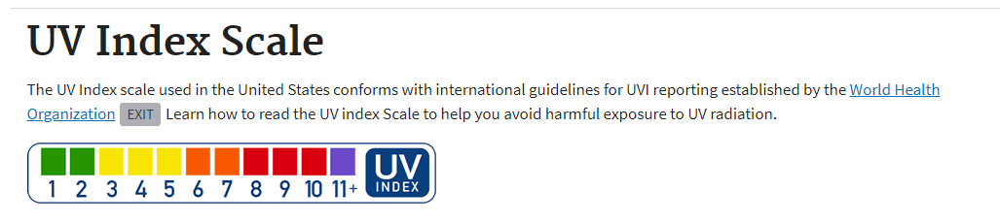

# Homework Assignment 6 - Weather Dashboard App

The purpose of this homwork assignment was to build a weather dashboard that will run within a browser and use [OpenWeather API](https://openweathermap.org/api) as a third-party API to retrieve weather data for any searched city entered in the dashboard. I have included a sample screenshot of my weather dashboard in the last section of this document.

As specified in the homework assignment's instructions, I developed the browser to meet the following requirements:

- Run in the browser with a responsive layout.
- Feature dynamically updated HTML and CSS.
- Access weather data by using the [OpenWeather API](https://openweathermap.org/api).
- Meet all acceptance criteria (included below).
- Use `localStorage` to store any persistent data.

## Links to My Weather Dashboard App and GitHub Repo

In the content below, I included links to both (a) my weather dashboard app and (b) the associated GitHub repo that I used to develop this app.

- GitHub Repo - [https://github.com/KEDuran/Weather_Dashboard](https://github.com/KEDuran/Weather_Dashboard)
- Link to My Weather Dashboard App - [https://keduran.github.io/Weather_Dashboard/](https://keduran.github.io/Weather_Dashboard/)

## Assignment Scope

In this section, I included the specific user story and acceptance criteria that was included in the homework assignment's instructions.

I also included a notes/FYI section below that provide additional details surrounding my approach for developing this weather dashboard.

### User Story from Homework Assignment Instructions

```
AS A traveler
I WANT to see the weather outlook for multiple cities
SO THAT I can plan a trip accordingly
```

### Acceptance Criteria from Homework Assignment Instructions

```
GIVEN a weather dashboard with form inputs
WHEN I search for a city
THEN I am presented with current and future conditions for that city and that city is added to the search history
WHEN I view current weather conditions for that city
THEN I am presented with the city name, the date, an icon representation of weather conditions, the temperature, the humidity, the wind speed, and the UV index
WHEN I view the UV index
THEN I am presented with a color that indicates whether the conditions are favorable, moderate, or severe
WHEN I view future weather conditions for that city
THEN I am presented with a 5-day forecast that displays the date, an icon representation of weather conditions, the temperature, and the humidity
WHEN I click on a city in the search history
THEN I am again presented with current and future conditions for that city
WHEN I open the weather dashboard
THEN I am presented with the last searched city forecast
```

### Notes to Consider for My Developer Approach

#### Last Searched City Logic

Based on the acceptance criteria outlined above, I developed the weather dashboard app to repopulate weather data upon refresh for the last city that was actually searched by (a) being typed into the search city input item and (b) then followed by clicking on the search button. _Any click activity within the city search history buttons will not trigger any "stored last city searched" logic included in the script.js file_.

#### Auto Default for No Search History Scenario

The weather dashboard is also designed to automatically populate Austin, Texas weather data if no previous city search history is avaliable. The weather dashboard screenshot below shows the weather data for only Austin, Texas because no city search historical entries had been made under teh GitHub pages from where I was viewing the weather dashboard.

#### Applied United States EPA UV Index Categories

Before starting this homework assignment, I conducted some additional research regarding UV index categories. Based on my research, the [United States Environmental Protection Agency](https://www.epa.gov/sunsafety/uv-index-1) measures UV index according to five categories - demonstrated in the UV index screenshot below. As a result, I used the following five categories when applying the coloration categories for the UV index readings in the weather dashboard app.



## Sample Screenshot of My Weather Dashboard App

In this section, I included a screenshot of my weather dashboard app below.


