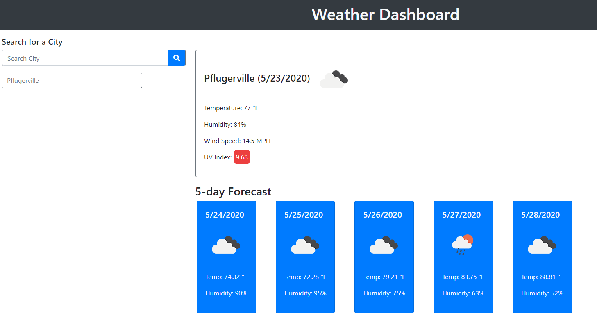

# Homework Assignment 6 - Weather Dashboard App

The purpose of this homwork assignment was to build a weather dashboard that will run within a browser and use [OpenWeather API](https://openweathermap.org/api) as a third-party API to retrieve weather data for any searched city. I have included a sample screenshot for my weather dashboard at the bottom of this ReadMe markdown document.

As specified in this homework assignment's instructions, I developed the browser to meet the following requirements:

- Run in the browser with a responsive layout.
- Feature dynamically updated HTML and CSS.
- Access weather data by using the [OpenWeather API](https://openweathermap.org/api).
- Meets all acceptance criteria (included below).
- Uses `localStorage` to store any persistent data.

## Links to My Weather Dashboard App and GitHub Repo

In the content below, I included links to (a) my weather dashboard app and (b) the associated GitHub repo that I used to develop this app.

- GitHub Repo - [https://github.com/KEDuran/Weather_Dashboard](https://github.com/KEDuran/Weather_Dashboard)
- Link to My Weather Dashboard App - [https://keduran.github.io/Weather_Dashboard/](https://keduran.github.io/Weather_Dashboard/)

## Assignment Scope

In this section, I included the specific user story and acceptance criteria that was included in this homework assignment's instructions.

### User Story from Homework Assignment Instructions

```
AS A traveler
I WANT to see the weather outlook for multiple cities
SO THAT I can plan a trip accordingly
```

### Acceptance Criteria from Homework Assignment Instructions

```
GIVEN a weather dashboard with form inputs
WHEN I search for a city
THEN I am presented with current and future conditions for that city and that city is added to the search history
WHEN I view current weather conditions for that city
THEN I am presented with the city name, the date, an icon representation of weather conditions, the temperature, the humidity, the wind speed, and the UV index
WHEN I view the UV index
THEN I am presented with a color that indicates whether the conditions are favorable, moderate, or severe
WHEN I view future weather conditions for that city
THEN I am presented with a 5-day forecast that displays the date, an icon representation of weather conditions, the temperature, and the humidity
WHEN I click on a city in the search history
THEN I am again presented with current and future conditions for that city
WHEN I open the weather dashboard
THEN I am presented with the last searched city forecast
```

## Sample Screenshot of My Weather Dashboard App

### FYI on My Approach

Based on the acceptance criteria outlined above, I developed the weather app to repopulate the weather dashboard data upon refresh for the last city that was actually searched by being typed into the search city input item and then followed by actually clicking on the search button. _Any click activity within the city search history buttons will not trigger any "last city searched" logic_.

- **Please note** - The weather dashboard is also designed to automatically default and populate Austin, Texas weather data if no city was previously searched. The last searched city I entered for testing was Pflugerville, TX so my sample screenshot below shows weather data for Pflugerville, TX as of Saturday (5/23/2020) night.


